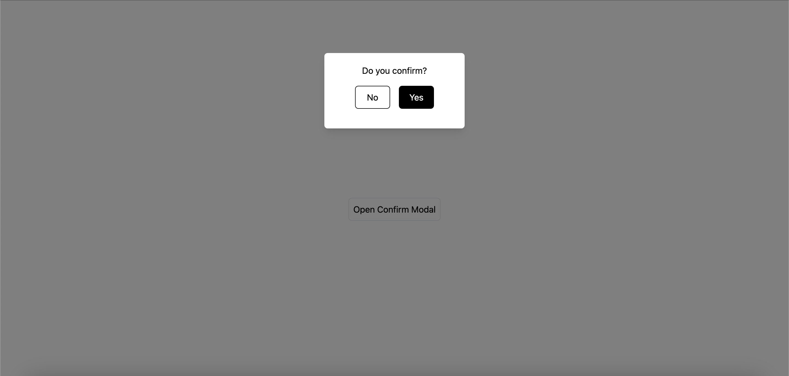
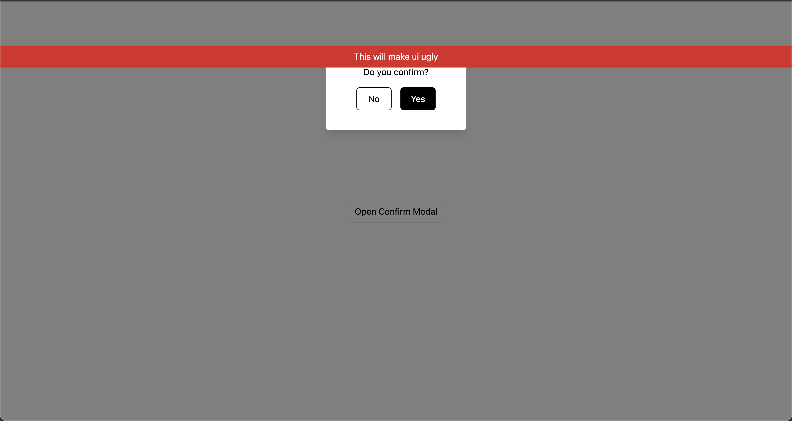
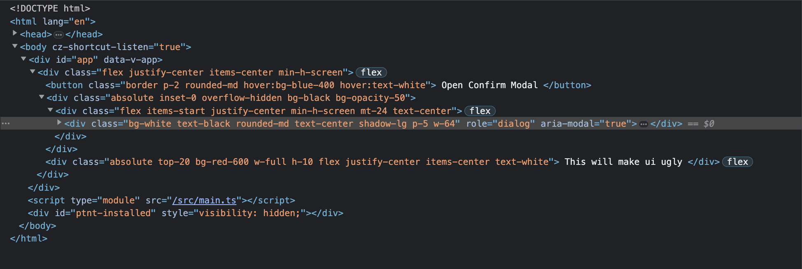
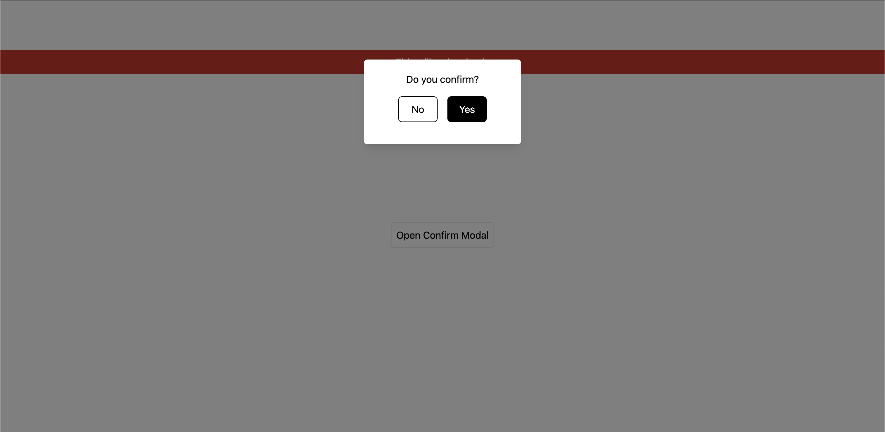
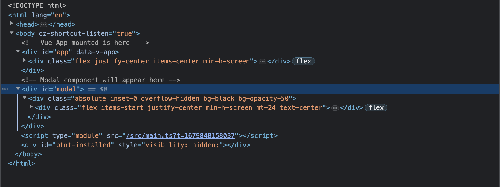
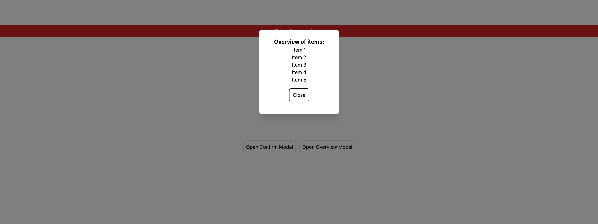
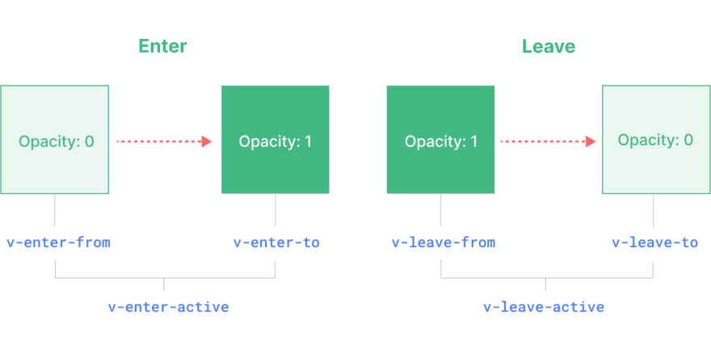

# 使用 Vue3 Teleport 製作對話框（Modal）


在這篇文章中，我會使用 Vue Teleport Component 以及一些實用的 Vue 技巧來製作一個簡單且可以復用的 Modal。

[原文](https://dev.to/alexandergekov/creating-better-modals-using-vue-teleport-3cd4)

Code Repository: [Github](https://github.com/abe1272001/teleport-modal)

## 前言

在網頁開發中，對話框（Modal）是常用的組件，它可以在用戶與網頁交互時，以不打斷原有流程的方式展現額外的資訊、功能或提醒等。但如果不小心設計不當，對話框也可能會妨礙用戶體驗。在 Vue 3.0 版本中新增了 Vue Teleport 功能，可以將組件的內容透過 Teleport 傳送到指定的 DOM 節點，使用 Teleport 來製作對話框，即便對話框組件本身被包在複雜的結構中，也能簡化其實現的方式。

## 什麼是 Teleport?

「Teleport」翻譯為中文是「傳送」，在 Vue 3 中，`Teleport` 是一個內置組件，可以將一個組件內部的一部分模板 "傳送" 到該組件的 DOM Tree 以外的指定 DOM 節點上。簡單來說，這代表我們可以實現渲染這個模板到 Dom Tree 的任何地方，即使該組件嵌套在深層的 Dom 之中，可以將它理解為哆拉 a 夢的任意門！

最常見的需求像是常被置於頂層的 `App` 組件中的 Modal, Popup, Notification 等組件，就非常適合使用 `Teleport` 來設計，如果這些組件可以完全的跟 `App` Dom 完全分開來渲染，開發者們可以更容易地處理這類組件，因為若有個組件有許多父層（parents）時，做 event handing, 設定 position, 調整 z-index 就會變得非常困難。

## Setup Project

使用 Vite 的 `vue-ts` 模板創建專案。

```zsh
pnpm create vite@latest teleport-modal --template vue-ts
```

另外安裝 Tailwindcss 來裝飾模板，詳細設定[在這裡](https://tailwindcss.com/docs/guides/vite)。

```zsh
pnpm install -D tailwindcss postcss autoprefixer

npx tailwindcss init -p
```

## 建立對話框 Modal 組件

先來做一個簡單的對話框組件, 然後使用 Tailwindcss 來裝飾它：

新建檔案 `ModalConfirm.vue`：

```html
<template>
  <div class="absolute inset-0 overflow-hidden bg-black bg-opacity-50">
    <div class="flex items-start justify-center min-h-screen mt-24 text-center">
      <div
        class="bg-white text-black rounded-md text-center shadow-lg p-5 w-64"
        role="dialog"
        aria-modal="true"
      >
        <h3>Do you confirm?</h3>
        <div class="flex justify-center py-4 text-white gap-4">
          <!-- We will handle these emits later -->
          <button
            @click="$emit('close')"
            class="border border-black bg-white text-black rounded-md w-16 py-2"
          >
            No
          </button>

          <button
            @click="$emit('close')"
            class="border border-black bg-black text-white rounded-md w-16 py-2"
          >
            Yes
          </button>
        </div>
      </div>
    </div>
  </div>
</template>
```

將 `ModalConfirm` 引入 `App.vue`：

```html
<script setup lang="ts">
  import { ref } from 'vue'
  import ModalConfirm from '@/components/ModalConfirm.vue'

  const show = ref(false)

  const openConfirm = () => {
    show.value = true
  }

  const closeConfirm = () => {
    show.value = false
  }
</script>

<template>
  <div class="flex justify-center items-center min-h-screen">
    <button
      class="border p-2 rounded-md hover:bg-blue-400 hover:text-white"
      @click="openConfirm"
    >
      Open Confirm Modal
    </button>
    <ModalConfirm v-if="show" @close="closeConfirm" />
  </div>
</template>
```

你可以看到，這裡有一些邏輯來控制 Modal 的開啟及關閉，另外也使用 emit 來控制 `ModalConfirm`，目前畫面如下圖：



## 破壞開啟 Modal 時的 UI

```html
<script setup lang="ts">
  import { ref } from 'vue'
  import ModalConfirm from '@/components/ModalConfirm.vue'

  const show = ref(false)

  const openConfirm = () => {
    show.value = true
  }

  const closeConfirm = () => {
    show.value = false
  }
</script>

<template>
  <div class="flex justify-center items-center min-h-screen">
    <button
      class="border p-2 rounded-md hover:bg-blue-400 hover:text-white"
      @click="openConfirm"
    >
      Open Confirm Modal
    </button>
    <ModalConfirm v-if="show" @close="closeConfirm" />
    <div
      class="absolute top-20 bg-red-600 w-full h-10 flex justify-center items-center text-white"
    >
      This will make ui ugly
    </div>
  </div>
</template>
```

這裡新增了一個使用 absolute 定位的元素，來模擬當 modal 被置於巢狀的結構中時可能會發生的情形，它有可能被其他元素所干擾。



來看一下 DOM 裡發生了什麼事!



你會發現我們的 `ModalConfirm` 跟 `This will make ui ugly` 元素是被渲染在同一個層級。那我們有什麼更好的方法將 Modal 渲染在其他地方呢?!

沒錯，就是 `Teleport` !

## 新增 Teleport (Vue Teleport component)

在 `index.html` 新增一個 `id="modal"` 的元素，我們的 Modal 將會被渲染在 Vue App 之外。

```html
<!DOCTYPE html>
<html lang="en">
  <head>
    <meta charset="UTF-8" />
    <link rel="icon" type="image/svg+xml" href="/vite.svg" />
    <meta name="viewport" content="width=device-width, initial-scale=1.0" />
    <title>Vite + Vue + TS</title>
  </head>
  <body>
    <!-- Vue App mounted is here  -->
    <div id="app"></div>
    <!-- Modal component will appear here -->
    <div id="modal"></div>
    <script type="module" src="/src/main.ts"></script>
  </body>
</html>
```

接著回到 `App.vue`：

```html
<script setup lang="ts">
  import { ref } from 'vue'
  import ModalConfirm from '@/components/ModalConfirm.vue'

  const show = ref(false)

  const openConfirm = () => {
    show.value = true
  }

  const closeConfirm = () => {
    show.value = false
  }
</script>

<template>
  <div class="flex justify-center items-center min-h-screen">
    <button
      class="border p-2 rounded-md hover:bg-blue-400 hover:text-white"
      @click="openConfirm"
    >
      Open Confirm Modal
    </button>
    <!-- Will render the content in element with id=modal -->
    <Teleport to="#modal">
      <ModalConfirm v-if="show" @close="closeConfirm" />
    </Teleport>

    <div
      class="absolute top-20 bg-red-600 w-full h-10 flex justify-center items-center text-white"
    >
      This will make ui ugly
    </div>
  </div>
</template>
```

使用了 Vue3 的 `<Teleport>` 組件，我們可以將 Modal 渲染於 Vue DOM 的外部，`Teleport` 接受一個 prop `to` (算是 CSS 選擇器)，這裡傳入 `#modal` 來對應 `index.html` 內的 `<div id="modal">`。

這時再去開啟 Modal，就會發現 Modal 不再被 absolute 定位的元素所遮蓋，如下圖：



來看一下目前 DOM 的情況：



太棒了！現在我們的 Modal 邏輯存在於 Vue app 中，但 Modal 卻是渲染在外部且並不會與其他元素有衝突。接下來我們再做近一步的優化。

## 建立 Composable (組合式函數)

來建立一個 Composable 讓顯示 Modal 的邏輯封裝在一個共用函數中，這樣我們就可以複用這段程式碼來開啟不同的 Modal。

在專案中建立 `composables` 資料夾，然後建立一個名叫 `useModal.ts` 的文件：

```ts
import { ref } from 'vue'

// tracking of component to render
const component = ref()

// tracking of whether to show modal
const show = ref(false)

export default function useModal() {
  return {
    component,
    show,
    // open/close methods for modal
    showModal: () => (show.value = true),
    closeModal: () => (show.value = false),
  }
}
```

以上是一個簡單 composable，return 兩個 refs 及兩個方法： `component` 用來追蹤不同 Modal 要渲染，`show` 用來控制 Modal 的顯示，另外兩個方法則是用來開起、關閉 Modal。

再回到 App.vue 改成使用 useModal：

```html
<script setup lang="ts">
  import { markRaw, ref } from 'vue'
  // import the composable
  import useModal from '@/composables/useModal'
  import ModalConfirm from '@/components/ModalConfirm.vue'

  const modal = useModal()

  // set the modal component to the ModalConfirm component and open it
  const openConfirmModal = () => {
    modal.component.value = markRaw(ModalConfirm)
    modal.showModal()
  }
</script>

<template>
  <div class="flex justify-center items-center min-h-screen">
    <button
      class="border p-2 rounded-md hover:bg-blue-400 hover:text-white"
      @click="openConfirmModal"
    >
      Open Confirm Modal
    </button>
    <teleport to="#modal">
      <ModalConfirm v-if="modal.show.value" @close="modal.closeModal" />
    </teleport>
    <div
      class="absolute top-20 bg-red-600 w-full h-10 flex justify-center items-center text-white"
    >
      This will make ui ugly
    </div>
  </div>
</template>
```

現在我們將開關 Modal 的邏輯及 data 更換成使用 composable 取代，使用 `openConfirmModal` 方法來指派 `ModalConfirm` 組件給 Modal，為了達到此目的我們使用了 `markRaw` helper。 [MarkRaw 詳細介紹](https://vuejs.org/api/reactivity-advanced.html#markraw)

如果我們現在測試它，它應該可以正常運作，只是我們將邏輯都轉移至 composable 之中，而且是可以複用的。

## 新增動態組件 (Vue Dynamic component)

既然我們已經有了 `ModalConfirm` 組件，如果我們想要動態的顯示不同的 Modal 基於其他使用情境，該怎麼做呢？ 因為在實際專案中應該不會只有一種 Modal。還記得我們有加入 `component` 在 `useModal` composable 嗎？我們可以將它與 Vue 的動態組件功能一起來顯示不同的 Modal。

我們來建立第二個 Modal，他跟第一個 Modal 很相似，僅用來模擬不同 Modal 的情境，來建立 `ModalOverview.vue` 吧：

```html
<template>
  <div class="absolute overflow-hidden inset-0 bg-black bg-opacity-50">
    <div class="flex items-start justify-center min-h-screen mt-24 text-center">
      <div
        class="bg-white text-black rounded-lg text-center shadow-xl p-6 w-64"
        role="dialog"
        aria-modal="true"
      >
        <h2 class="text-lg font-bold">Overview of items:</h2>
        <ul>
          <li>Item 1</li>
          <li>Item 2</li>
          <li>Item 3</li>
          <li>Item 4</li>
          <li>Item 5</li>
        </ul>
        <div class="flex justify-center py-4">
          <button
            class="border border-black bg-white text-black rounded-md w-16 py-2"
            @click="$emit('close')"
          >
            Close
          </button>
        </div>
      </div>
    </div>
  </div>
</template>
```

現在我們將第二個 Modal 加進 `App.vue`：

```html
<script setup lang="ts">
  import { markRaw } from 'vue'
  // import the composable
  import useModal from '@/composables/useModal'
  import ModalConfirm from '@/components/ModalConfirm.vue'
  import ModalOverview from '@/components/ModalOverview.vue'

  const modal = useModal()

  // set the modal component to the ModalConfirm component and open it
  const openConfirmModal = () => {
    modal.component.value = markRaw(ModalConfirm)
    modal.showModal()
  }

  const openOverviewModal = () => {
    modal.component.value = markRaw(ModalOverview)
    modal.showModal()
  }
</script>

<template>
  <div class="flex justify-center items-center min-h-screen">
    <div class="flex gap-3">
      <button
        class="border p-2 rounded-md hover:bg-blue-400 hover:text-white"
        @click="openConfirmModal"
      >
        Open Confirm Modal
      </button>
      <button
        class="border p-2 rounded-md hover:bg-blue-400 hover:text-white"
        @click="openOverviewModal"
      >
        Open Overview Modal
      </button>
    </div>
    <teleport to="#modal">
      <component
        :is="modal.component.value"
        v-if="modal.show.value"
        @close="modal.closeModal"
      />
    </teleport>
    <div
      class="absolute top-20 bg-red-600 w-full h-10 flex justify-center items-center text-white"
    >
      This will make ui ugly
    </div>
  </div>
</template>
```

現在你可以看到，我們引入 `ModalOverview` 和新增了第二個按鈕，並將其指派給了 composable 和開啟 Modal。更重要的是我們使用了 `<component :is="">` 動態組件來切換 Modal， `is` prop 可以接受組件名稱或是組件本身。我們的 case 則是使用來自 `useModal` composable 內的 `component`，第二個 Modal 畫面如下：



## 新增 Transition (Vue Transition component)

最後，我們來新增 Transition，讓 Modal 在畫面上呈現漂亮的動畫效果，我們可以使用 Vue 的另一個原生組件 -- `<Transition>`

在 `App.vue` :

```html
<script setup lang="ts">
  import { markRaw } from 'vue'
  // import the composable
  import useModal from '@/composables/useModal'
  import ModalConfirm from '@/components/ModalConfirm.vue'
  import ModalOverview from '@/components/ModalOverview.vue'

  const modal = useModal()

  // set the modal component to the ModalConfirm component and open it
  const openConfirmModal = () => {
    modal.component.value = markRaw(ModalConfirm)
    modal.showModal()
  }

  const openOverviewModal = () => {
    modal.component.value = markRaw(ModalOverview)
    modal.showModal()
  }
</script>

<template>
  <div class="flex justify-center items-center min-h-screen">
    <div class="flex gap-3">
      <button
        class="border p-2 rounded-md hover:bg-blue-400 hover:text-white"
        @click="openConfirmModal"
      >
        Open Confirm Modal
      </button>
      <button
        class="border p-2 rounded-md hover:bg-blue-400 hover:text-white"
        @click="openOverviewModal"
      >
        Open Overview Modal
      </button>
    </div>
    <teleport to="#modal">
      <Transition>
        <component
          :is="modal.component.value"
          v-if="modal.show.value"
          @close="modal.closeModal"
        />
      </Transition>
    </teleport>
    <div
      class="absolute top-20 bg-red-600 w-full h-10 flex justify-center items-center text-white"
    >
      This will make ui ugly
    </div>
  </div>
</template>

<style scoped>
  .v-enter-active,
  .v-leave-active {
    transition: opacity 0.5s ease;
  }

  .v-enter-from,
  .v-leave-to {
    opacity: 0;
  }
</style>
```

我們需要新增額外的 CSS classes 在 `style` 中，以下是 vue 的 Transition 樣式表：



這樣我們的 Modal 就大功告成啦！！

## 結論

經過這教學，我們學會處理 Vue Teleport component，以及 Vue Transition component，也使用了最佳實踐並提取了額外的邏輯到 Composable。最後我們也學到了 Vue Dynamic component，讓我們能夠渲染不同型態的 Modal。

## 有用的資源

- [Vue Teleport](https://vuejs.org/guide/built-ins/teleport.html)
- [Vue Transition](https://vuejs.org/guide/built-ins/transition.html#css-based-transitions)
- [Vue markraw](https://vuejs.org/api/reactivity-advanced.html#markraw)
- [Vue dynamic components](https://vuejs.org/guide/essentials/component-basics.html#dynamic-components)
